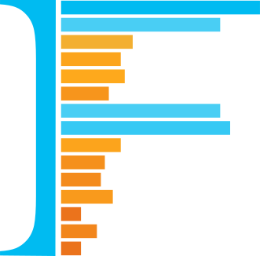

# isolation-forest
[](https://github.com/linkedin/isolation-forest/actions/workflows/ci.yml?query=branch%3Amaster+event%3Apush)
[](https://github.com/linkedin/isolation-forest/releases/)
[](LICENSE)

## Table of contents
- [Introduction](#introduction)
- [Features](#features)
- [Getting started](#getting-started)
  - [Building the library](#building-the-library)
  - [Add an isolation-forest dependency to your project](#add-an-isolation-forest-dependency-to-your-project)
- [Usage examples](#usage-examples)
  - [Model parameters](#model-parameters)
  - [Training and scoring](#training-and-scoring)
  - [Saving and loading a trained model](#saving-and-loading-a-trained-model)
- [Extended Isolation Forest](#extended-isolation-forest)
  - [When to use Extended Isolation Forest](#when-to-use-extended-isolation-forest)
  - [Extended Isolation Forest parameters](#extended-isolation-forest-parameters)
  - [Extended Isolation Forest usage example](#extended-isolation-forest-usage-example)
- [ONNX conversion for portable inference](#onnx-conversion-for-portable-inference)
  - [Converting a trained model to ONNX](#converting-a-trained-model-to-onnx)
  - [Using the ONNX model for inference (example in Python)](#using-the-onnx-model-for-inference-example-in-python)
- [Performance and benchmarks](#performance-and-benchmarks)
- [Copyright and license](#copyright-and-license)
- [Contributing](#contributing)
- [Citing this project](#citing-this-project)
- [References](#references)

## Introduction

This is a distributed Scala/Spark implementation of the Isolation Forest unsupervised outlier detection
algorithm. It includes both the standard Isolation Forest and the Extended Isolation Forest,
which uses random hyperplane splits to eliminate the axis-aligned bias of the original algorithm. The standard
Isolation Forest also features support for ONNX export for easy cross-platform inference. This library was
created by [James Verbus](https://www.linkedin.com/in/jamesverbus/) from the LinkedIn Anti-Abuse AI team.

## Features

* **Distributed training and scoring:** The `isolation-forest` module supports distributed training and scoring in Scala
  using Spark data structures. It inherits from the `Estimator` and `Model` classes in [Spark's ML library](https://spark.apache.org/mllib/) in
  order to take advantage of machinery such as `Pipeline`s. Model persistence on HDFS is supported.
* **Extended Isolation Forest:** The `ExtendedIsolationForest` variant uses random hyperplane splits instead of
  axis-aligned splits, eliminating the directional bias present in the standard algorithm. This is especially
  useful for detecting anomalies in data with correlated features or anomalies that don't align with individual feature axes.
* **Broad portability via ONNX:** The `isolation-forest-onnx` module provides a Python-based converter to convert a
  trained standard `IsolationForestModel` to ONNX format for broad portability across platforms and languages.
  [ONNX](https://onnx.ai/) is an open format built to represent machine learning models.
  **Note:** ONNX export is currently supported for the standard `IsolationForest` only. The `ExtendedIsolationForest`
  uses hyperplane splits that are not compatible with the axis-aligned tree ensemble representation used by the
  ONNX converter.

## Getting started

### Building the library

To build using the default of Scala 2.13.14 and Spark 3.5.5, run the following:

```bash
./gradlew build
```
This will produce a jar file in the `./isolation-forest/build/libs/` directory.

If you want to use the library with arbitrary Spark and Scala versions, you can specify this when running the
build command.

```bash
./gradlew build -PsparkVersion=3.5.5 -PscalaVersion=2.13.14
```

To force a rebuild of the library, you can use:
```bash
./gradlew clean build --no-build-cache
```

To just run the tests:
```bash
./gradlew test
```

### Add an isolation-forest dependency to your project

Please check [Maven Central](https://repo.maven.apache.org/maven2/com/linkedin/isolation-forest/) for the latest
artifact versions.

#### Gradle example

The artifacts are available in Maven Central, so you can specify the Maven Central repository in the top-level
`build.gradle` file.

```groovy
repositories {
    mavenCentral()
}
```

Add the isolation-forest dependency to the module-level `build.gradle` file. Here is an example for a recent
spark scala version combination.

```groovy
dependencies {
    implementation("com.linkedin.isolation-forest:isolation-forest_3.5.5_2.13:<latest-version>")
}
```

#### Maven example

If you are using the Maven Central repository, declare the isolation-forest dependency in your project's `pom.xml` file.
Here is an example for a recent Spark/Scala version combination.

```xml
<dependency>
  <groupId>com.linkedin.isolation-forest</groupId>
  <artifactId>isolation-forest_3.5.5_2.13</artifactId>
  <version>&lt;latest-version&gt;</version>
</dependency>
```

## Usage examples

### Model parameters

| Parameter          | Default Value    | Description                                                                                                                                                                                                                                                                                                                                                                          |
|--------------------|------------------|--------------------------------------------------------------------------------------------------------------------------------------------------------------------------------------------------------------------------------------------------------------------------------------------------------------------------------------------------------------------------------------|
| numEstimators      | 100              | The number of trees in the ensemble.                                                                                                                                                                                                                                                                                                                                                 |
| maxSamples         | 256              | The number of samples used to train each tree. If this value is between 0.0 and 1.0, then it is treated as a fraction. If it is >1.0, then it is treated as a count.                                                                                                                                                                                                                 |
| contamination      | 0.0              | The fraction of outliers in the training data set. If this is set to 0.0, it speeds up the training and all predicted labels will be false. The model and outlier scores are otherwise unaffected by this parameter.                                                                                                                                                                 |
| contaminationError | 0.0              | The error allowed when calculating the threshold required to achieve the specified contamination fraction. The default is 0.0, which forces an exact calculation of the threshold. The exact calculation is slow and can fail for large datasets. If there are issues with the exact calculation, a good choice for this parameter is often 1% of the specified contamination value. |
| maxFeatures        | 1.0              | The number of features used to train each tree. If this value is between 0.0 and 1.0, then it is treated as a fraction. If it is >1.0, then it is treated as a count.                                                                                                                                                                                                                |
| bootstrap          | false            | If true, draw sample for each tree with replacement. If false, do not sample with replacement.                                                                                                                                                                                                                                                                                       |
| randomSeed         | 1                | The seed used for the random number generator.                                                                                                                                                                                                                                                                                                                                       |
| featuresCol        | "features"       | The feature vector. This column must exist in the input DataFrame for training and scoring.                                                                                                                                                                                                                                                                                          |
| predictionCol      | "predictedLabel" | The predicted label. This column is appended to the input DataFrame upon scoring.                                                                                                                                                                                                                                                                                                    |
| scoreCol           | "outlierScore"   | The outlier score. This column is appended to the input DataFrame upon scoring.                                                                                                                                                                                                                                                                                                      |

### Training and scoring

Here is an example demonstrating how to import the library, create a new `IsolationForest`
instance, set the model hyperparameters, train the model, and then score the training data. `data`
is a Spark DataFrame with a column named `features` that contains a
`org.apache.spark.ml.linalg.Vector` of the attributes to use for training. In this example, the
DataFrame `data` also has a `label` column; it is not used in the training process, but could
be useful for model evaluation.

```scala
import com.linkedin.relevance.isolationforest._
import org.apache.spark.ml.feature.VectorAssembler

/**
  * Load and prepare data
  */

// Dataset from http://odds.cs.stonybrook.edu/shuttle-dataset/
val rawData = spark.read
  .format("csv")
  .option("comment", "#")
  .option("header", "false")
  .option("inferSchema", "true")
  .load("isolation-forest/src/test/resources/shuttle.csv")

val cols = rawData.columns
val labelCol = cols.last
 
val assembler = new VectorAssembler()
  .setInputCols(cols.slice(0, cols.length - 1))
  .setOutputCol("features")
val data = assembler
  .transform(rawData)
  .withColumnRenamed(labelCol, "label")
  .select("features", "label")

// scala> data.printSchema
// root
//  |-- features: vector (nullable = true)
//  |-- label: integer (nullable = true)

/**
  * Train the model
  */

val contamination = 0.1
val isolationForest = new IsolationForest()
  .setNumEstimators(100)
  .setBootstrap(false)
  .setMaxSamples(256)
  .setMaxFeatures(1.0)
  .setFeaturesCol("features")
  .setPredictionCol("predictedLabel")
  .setScoreCol("outlierScore")
  .setContamination(contamination)
  .setContaminationError(0.01 * contamination)
  .setRandomSeed(1)

val isolationForestModel = isolationForest.fit(data)
 
/**
  * Score the training data
  */

val dataWithScores = isolationForestModel.transform(data)

// scala> dataWithScores.printSchema
// root
//  |-- features: vector (nullable = true)
//  |-- label: integer (nullable = true)
//  |-- outlierScore: double (nullable = false)
//  |-- predictedLabel: double (nullable = false)
```

The output DataFrame, `dataWithScores`, is identical to the input `data` DataFrame but has two
additional result columns appended with their names set via model parameters; in this case, these
are named `predictedLabel` and `outlierScore`.

### Saving and loading a trained model

Once you've trained an `isolationForestModel` instance as per the instructions above, you can use the
following commands to save the model to HDFS and reload it as needed.

```scala
val path = "/user/testuser/isolationForestWriteTest"

/**
  * Persist the trained model on disk
  */

// You can ensure you don't overwrite an existing model by removing .overwrite from this command
isolationForestModel.write.overwrite.save(path)

/**
  * Load the saved model from disk
  */

val isolationForestModel2 = IsolationForestModel.load(path)
```

## Extended Isolation Forest

The Extended Isolation Forest (EIF) generalizes the standard Isolation Forest by replacing axis-aligned
splits with random hyperplane splits. This eliminates the bias that standard Isolation Forest has toward
detecting anomalies along individual feature axes, making it more effective for data with correlated
features or anomalies that lie along non-axis-aligned directions. For full details, see
[Hariri et al., "Extended Isolation Forest," 2018](https://arxiv.org/abs/1811.02141).

### When to use Extended Isolation Forest

Use `ExtendedIsolationForest` instead of `IsolationForest` when:

* Your data has correlated features where anomalies may not be separable along any single axis.
* You observe "ghost" high-score regions along feature axes in standard IF that don't correspond to
  real anomalies (a known artifact of axis-aligned splits).
* You want a more rotationally invariant anomaly detector.

The standard `IsolationForest` remains a good default for high-dimensional, uncorrelated data where
axis-aligned splits are sufficient and computational cost matters.

### Extended Isolation Forest parameters

`ExtendedIsolationForest` accepts all the same parameters as `IsolationForest` (see the
[model parameters table](#model-parameters) above), plus one additional parameter:

| Parameter      | Default Value       | Description                                                                                                                                                                                          |
|----------------|---------------------|------------------------------------------------------------------------------------------------------------------------------------------------------------------------------------------------------|
| extensionLevel | numFeatures - 1     | Controls the number of non-zero coordinates in each random hyperplane normal vector. `extensionLevel + 1` coordinates are non-zero. `0` uses axis-aligned splits. The maximum value is `numFeatures - 1` (fully extended), which is the default if not set. EIF stores these hyperplanes sparsely, so per-node storage and dot products scale with the number of non-zero coordinates rather than the full input dimension. |

**Important: interaction with `maxFeatures`.** When `maxFeatures < 1.0`, each tree trains on a random
subset of features. The `extensionLevel` is relative to this subspace, not the original dataset
dimensionality. For example, if your data has 10 features and `maxFeatures = 0.5`, each tree uses 5
features, and the valid range for `extensionLevel` is `[0, 4]`. If not set, `extensionLevel` defaults
to `numFeatures - 1` for the resolved subspace. If you explicitly set `extensionLevel` to a value
greater than `numFeatures - 1`, training will throw an error.

EIF hyperplanes are stored in the original feature space using only their non-zero coordinates. In
practice, this means `extensionLevel` controls not only expressiveness but also node-local storage
and traversal cost, while `maxFeatures` still determines the feature subspace available to each
tree.

### Extended Isolation Forest usage example

```scala
import com.linkedin.relevance.isolationforest.extended._

val contamination = 0.02
val extendedIsolationForest = new ExtendedIsolationForest()
  .setNumEstimators(100)
  .setBootstrap(false)
  .setMaxSamples(256)
  .setMaxFeatures(1.0)
  .setFeaturesCol("features")
  .setPredictionCol("predictedLabel")
  .setScoreCol("outlierScore")
  .setContamination(contamination)
  .setContaminationError(0.01 * contamination)
  .setExtensionLevel(5)  // Fully extended for a 6-feature dataset (extensionLevel + 1 = 6 non-zero coordinates)
  .setRandomSeed(1)

val extendedIsolationForestModel = extendedIsolationForest.fit(data)
val dataWithScores = extendedIsolationForestModel.transform(data)
```

Saving and loading works the same way as the standard model:

```scala
// Save
extendedIsolationForestModel.write.overwrite.save(path)

// Load
val loadedModel = ExtendedIsolationForestModel.load(path)
```

## ONNX conversion for portable inference

> **Note:** ONNX conversion is supported for the standard `IsolationForestModel` only. The
> `ExtendedIsolationForestModel` uses hyperplane-based splits that are not compatible with the
> axis-aligned tree ensemble representation used by the current ONNX converter.

### Converting a trained model to ONNX

The artifacts associated with the `isolation-forest-onnx` module are [available](https://pypi.org/project/isolation-forest-onnx/) in PyPI.

The ONNX converter can be installed using `pip`. It is recommended to use the same version of the converter as the
version of the `isolation-forest` library used to train the model.

```bash
pip install isolation-forest-onnx==<matching-version>
```

You can then import and use the converter in Python.

```python
import os
from isolationforestonnx.isolation_forest_converter import IsolationForestConverter

# This is the same path used in the previous example showing how to save the model in Scala above.
path = '/user/testuser/isolationForestWriteTest'

# Get model data path
data_dir_path = path + '/data'
avro_model_file = os.listdir(data_dir_path)
model_file_path = data_dir_path + '/' + avro_model_file[0]

# Get model metadata file path
metadata_dir_path =  path + '/metadata'
metadata_file = os.listdir(path + '/metadata/')
metadata_file_path = metadata_dir_path + '/' + metadata_file[0]

# Convert the model to ONNX format (this will return the ONNX model in memory)
converter = IsolationForestConverter(model_file_path, metadata_file_path)
onnx_model = converter.convert()

# Convert and save the model in ONNX format (this will save the ONNX model to disk)
onnx_model_path = '/user/testuser/isolationForestWriteTest.onnx'
converter.convert_and_save(onnx_model_path)
```

### Using the ONNX model for inference (example in Python)

```python
import numpy as np
import onnx
from onnxruntime import InferenceSession

# `onnx_model_path` the same path used above in the convert and save operation
onnx_model_path = '/user/testuser/isolationForestWriteTest.onnx'
dataset_path = 'isolation-forest-onnx/test/resources/shuttle.csv'
num_examples_to_print = 10

# Load data
input_data = np.loadtxt(dataset_path, delimiter=',')
num_features = input_data.shape[1] - 1
last_col_index = num_features
print(f'Number of features: {num_features}')

# The last column is the label column
input_dict = {'features': np.delete(input_data, last_col_index, 1).astype(dtype=np.float32)}
actual_labels = input_data[:, last_col_index]

# Load the ONNX model from local disk and do inference
onx = onnx.load(onnx_model_path)
sess = InferenceSession(onx.SerializeToString())
res = sess.run(None, input_dict)

# Print scores
actual_outlier_scores = res[0]
print('ONNX Converter outlier scores:')
print(np.transpose(actual_outlier_scores[:num_examples_to_print])[0])
```

## Performance and benchmarks

We benchmarked the standard Isolation Forest (`StandardIF`), Extended Isolation Forest at extension
level 0 (`ExtendedIF_0`), and the fully extended variant (`ExtendedIF_max`) against the Liu et al.
2008 paper results and the
[reference Python EIF implementation](https://github.com/sahandha/eif) (`Ref. Python`). All results
use 100 trees, 256 samples per tree, 10 trials with unique random seeds, and report the mean
&plusmn; standard error of the mean. The `Ref. Python` columns show EIF results at the corresponding
extension level, not standard IF.

<div style="overflow-x: auto;">

| Dataset | Dim | Model | AUROC | AUPRC | Liu&nbsp;et&nbsp;al.&nbsp;AUROC&nbsp;(IF) | Ref.&nbsp;Python&nbsp;AUROC&nbsp;(EIF) | Ref.&nbsp;Python&nbsp;AUPRC&nbsp;(EIF) |
|---|--:|---|---|---|--:|---|---|
| [Annthyroid](http://odds.cs.stonybrook.edu/annthyroid-dataset/) | 6 | StandardIF | 0.813 &plusmn; 0.004 | 0.312 &plusmn; 0.004 | 0.82 | | |
| | | ExtendedIF_0 | 0.813 &plusmn; 0.004 | 0.307 &plusmn; 0.004 | | 0.822 &plusmn; 0.004 | 0.314 &plusmn; 0.007 |
| | | ExtendedIF_max | 0.646 &plusmn; 0.002 | 0.1791 &plusmn; 0.0017 | | 0.651 &plusmn; 0.003 | 0.183 &plusmn; 0.005 |
| [Arrhythmia](http://odds.cs.stonybrook.edu/arrhythmia-dataset/) | 274 | StandardIF | 0.8064 &plusmn; 0.0019 | 0.494 &plusmn; 0.006 | 0.80 | | |
| | | ExtendedIF_0 | 0.802 &plusmn; 0.002 | 0.478 &plusmn; 0.004 | | 0.796 &plusmn; 0.004 | 0.462 &plusmn; 0.005 |
| | | ExtendedIF_max | 0.810 &plusmn; 0.004 | 0.495 &plusmn; 0.005 | | 0.803 &plusmn; 0.003 | 0.490 &plusmn; 0.004 |
| [Breastw](http://odds.cs.stonybrook.edu/breast-cancer-wisconsin-original-dataset/) | 9 | StandardIF | 0.9864 &plusmn; 0.0003 | 0.9684 &plusmn; 0.0008 | 0.99 | | |
| | | ExtendedIF_0 | 0.9878 &plusmn; 0.0003 | 0.9726 &plusmn; 0.0008 | | 0.9873 &plusmn; 0.0005 | 0.9704 &plusmn; 0.0016 |
| | | ExtendedIF_max | 0.9835 &plusmn; 0.0004 | 0.9568 &plusmn; 0.0015 | | 0.9841 &plusmn; 0.0006 | 0.959 &plusmn; 0.002 |
| [Cardio](http://odds.cs.stonybrook.edu/cardiotocography-dataset/) | 21 | StandardIF | 0.928 &plusmn; 0.002 | 0.565 &plusmn; 0.008 | - | | |
| | | ExtendedIF_0 | 0.921 &plusmn; 0.002 | 0.553 &plusmn; 0.009 | | 0.918 &plusmn; 0.003 | 0.546 &plusmn; 0.013 |
| | | ExtendedIF_max | 0.933 &plusmn; 0.002 | 0.541 &plusmn; 0.006 | | 0.931 &plusmn; 0.002 | 0.547 &plusmn; 0.009 |
| [ForestCover](http://odds.cs.stonybrook.edu/forestcovercovertype-dataset/) | 10 | StandardIF | 0.882 &plusmn; 0.006 | 0.051 &plusmn; 0.003 | 0.88 | | |
| | | ExtendedIF_0 | 0.865 &plusmn; 0.008 | 0.050 &plusmn; 0.005 | | 0.872 &plusmn; 0.010 | 0.049 &plusmn; 0.004 |
| | | ExtendedIF_max | 0.688 &plusmn; 0.008 | 0.0138 &plusmn; 0.0003 | | 0.662 &plusmn; 0.009 | 0.0129 &plusmn; 0.0004 |
| [Http (KDDCUP99)](http://odds.cs.stonybrook.edu/http-kddcup99-dataset/) | 3 | StandardIF | 0.99970 &plusmn; 0.00010 | 0.93 &plusmn; 0.02 | 1.00 | | |
| | | ExtendedIF_0 | 0.99410 &plusmn; 0.00010 | 0.392 &plusmn; 0.004 | | 0.99390 &plusmn; 0.00010 | 0.379 &plusmn; 0.004 |
| | | ExtendedIF_max | 0.99410 &plusmn; 0.00010 | 0.379 &plusmn; 0.006 | | 0.9939 &plusmn; 0.0003 | 0.371 &plusmn; 0.009 |
| [Ionosphere](http://odds.cs.stonybrook.edu/ionosphere-dataset/) | 33 | StandardIF | 0.8443 &plusmn; 0.0002 | 0.8014 &plusmn; 0.0003 | 0.85 | | |
| | | ExtendedIF_0 | 0.8568 &plusmn; 0.0006 | 0.8108 &plusmn; 0.0007 | | 0.8556 &plusmn; 0.0016 | 0.808 &plusmn; 0.002 |
| | | ExtendedIF_max | 0.9075 &plusmn; 0.0002 | 0.8804 &plusmn; 0.0002 | | 0.9061 &plusmn; 0.0014 | 0.876 &plusmn; 0.002 |
| [Mammography](http://odds.cs.stonybrook.edu/mammography-dataset/) | 6 | StandardIF | 0.8649 &plusmn; 0.0015 | 0.218 &plusmn; 0.007 | 0.86 | | |
| | | ExtendedIF_0 | 0.865 &plusmn; 0.002 | 0.220 &plusmn; 0.006 | | 0.868 &plusmn; 0.002 | 0.229 &plusmn; 0.013 |
| | | ExtendedIF_max | 0.8630 &plusmn; 0.0010 | 0.190 &plusmn; 0.003 | | 0.8639 &plusmn; 0.0016 | 0.184 &plusmn; 0.004 |
| [Mulcross](https://www.openml.org/d/40897) | 4 | StandardIF | 0.9910 &plusmn; 0.0009 | 0.852 &plusmn; 0.014 | 0.97 | | |
| | | ExtendedIF_0 | 0.938 &plusmn; 0.002 | 0.428 &plusmn; 0.009 | | 0.960 &plusmn; 0.003 | 0.538 &plusmn; 0.017 |
| | | ExtendedIF_max | 0.940 &plusmn; 0.003 | 0.442 &plusmn; 0.011 | | 0.941 &plusmn; 0.005 | 0.45 &plusmn; 0.02 |
| [Pima](http://odds.cs.stonybrook.edu/pima-indians-diabetes-dataset/) | 8 | StandardIF | 0.668 &plusmn; 0.004 | 0.490 &plusmn; 0.003 | 0.67 | | |
| | | ExtendedIF_0 | 0.667 &plusmn; 0.004 | 0.507 &plusmn; 0.004 | | 0.675 &plusmn; 0.005 | 0.514 &plusmn; 0.005 |
| | | ExtendedIF_max | 0.644 &plusmn; 0.003 | 0.498 &plusmn; 0.002 | | 0.640 &plusmn; 0.004 | 0.493 &plusmn; 0.004 |
| [Satellite](http://odds.cs.stonybrook.edu/satellite-dataset/) | 36 | StandardIF | 0.717 &plusmn; 0.008 | 0.672 &plusmn; 0.008 | 0.71 | | |
| | | ExtendedIF_0 | 0.715 &plusmn; 0.004 | 0.675 &plusmn; 0.003 | | 0.700 &plusmn; 0.004 | 0.664 &plusmn; 0.006 |
| | | ExtendedIF_max | 0.725 &plusmn; 0.003 | 0.704 &plusmn; 0.004 | | 0.740 &plusmn; 0.005 | 0.711 &plusmn; 0.005 |
| [Shuttle](http://odds.cs.stonybrook.edu/shuttle-dataset/) | 9 | StandardIF | 0.9971 &plusmn; 0.0002 | 0.9742 &plusmn; 0.0017 | 1.00 | | |
| | | ExtendedIF_0 | 0.9974 &plusmn; 0.0002 | 0.9789 &plusmn; 0.0014 | | 0.99750 &plusmn; 0.00010 | 0.9805 &plusmn; 0.0010 |
| | | ExtendedIF_max | 0.9934 &plusmn; 0.0002 | 0.822 &plusmn; 0.004 | | 0.9932 &plusmn; 0.0002 | 0.818 &plusmn; 0.003 |
| [Smtp (KDDCUP99)](http://odds.cs.stonybrook.edu/smtp-kddcup99-dataset/) | 3 | StandardIF | 0.9099 &plusmn; 0.0014 | 0.00450 &plusmn; 0.00010 | 0.88 | | |
| | | ExtendedIF_0 | 0.896 &plusmn; 0.002 | 0.00400 &plusmn; 0.00010 | | 0.897 &plusmn; 0.002 | 0.00410 &plusmn; 0.00010 |
| | | ExtendedIF_max | 0.858 &plusmn; 0.003 | 0.0098 &plusmn; 0.0011 | | 0.857 &plusmn; 0.003 | 0.014 &plusmn; 0.003 |

</div>

**Key observations:**

* **StandardIF** results are in agreement with the original Liu et al. paper.
* **ExtendedIF_max closely matches the reference Python EIF** across all 13 datasets.
* **EIF improves on ionosphere** (AUROC 0.907 vs 0.844, AUPRC 0.880 vs 0.801) and **satellite**
  (AUROC 0.725 vs 0.717, AUPRC 0.704 vs 0.672). EIF underperforms on some datasets (cover, http, 
  smtp, mulcross).
* **ExtendedIF_0 is not equivalent to StandardIF.** Both use axis-aligned splits, but standard IF
  retries on constant features while EIF does not (matching the reference Python and C++
  implementations). ExtendedIF_0 closely matches the reference Python EIF on all datasets.

## Copyright and license

Copyright 2019 LinkedIn Corporation
All Rights Reserved.

Licensed under the BSD 2-Clause License (the "License").
See [License](LICENSE) in the project root for license information.

## Contributing

If you would like to contribute to this project, please review the instructions [here](CONTRIBUTING.md). 

## Citing this project

If you use this library in your research or project, please cite it using the metadata in
[CITATION.cff](CITATION.cff), or use the following BibTeX entry:

```bibtex
@software{isolation_forest,
  author = {Verbus, James},
  title = {isolation-forest},
  year = {2019},
  url = {https://github.com/linkedin/isolation-forest},
  license = {BSD-2-Clause}
}
```

## References

* F. T. Liu, K. M. Ting, and Z.-H. Zhou, “Isolation forest,” in 2008 Eighth IEEE International Conference on Data Mining, 2008, pp. 413–422.
* F. T. Liu, K. M. Ting, and Z.-H. Zhou, “Isolation-based anomaly detection,” ACM Transactions on Knowledge Discovery from Data (TKDD), vol. 6, no. 1, p. 3, 2012.
* S. Hariri, M. Carrasco Kind, and R. J. Brunner, “Extended Isolation Forest,” IEEE Transactions on Knowledge and Data Engineering, 2019. [DOI:10.1109/TKDE.2019.2947676](https://doi.org/10.1109/TKDE.2019.2947676), [arXiv:1811.02141](https://arxiv.org/abs/1811.02141).
* S. Hariri, "eif: Extended Isolation Forest for Anomaly Detection," [https://github.com/sahandha/eif](https://github.com/sahandha/eif).
* Shebuti Rayana (2016). ODDS Library [http://odds.cs.stonybrook.edu]. Stony Brook, NY: Stony Brook University, Department of Computer Science.
